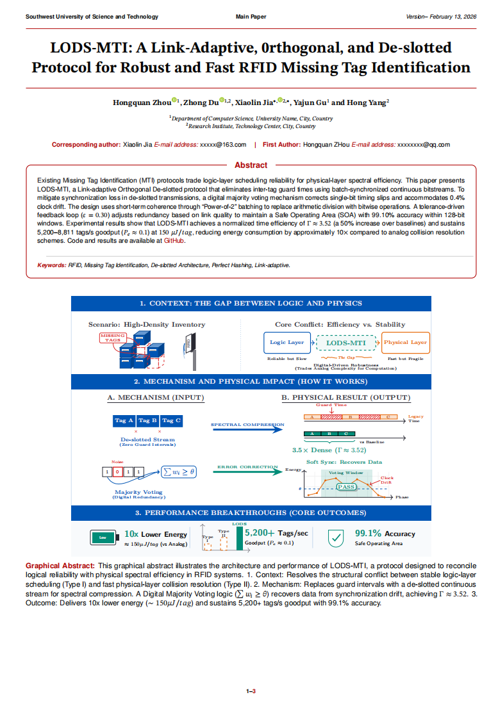
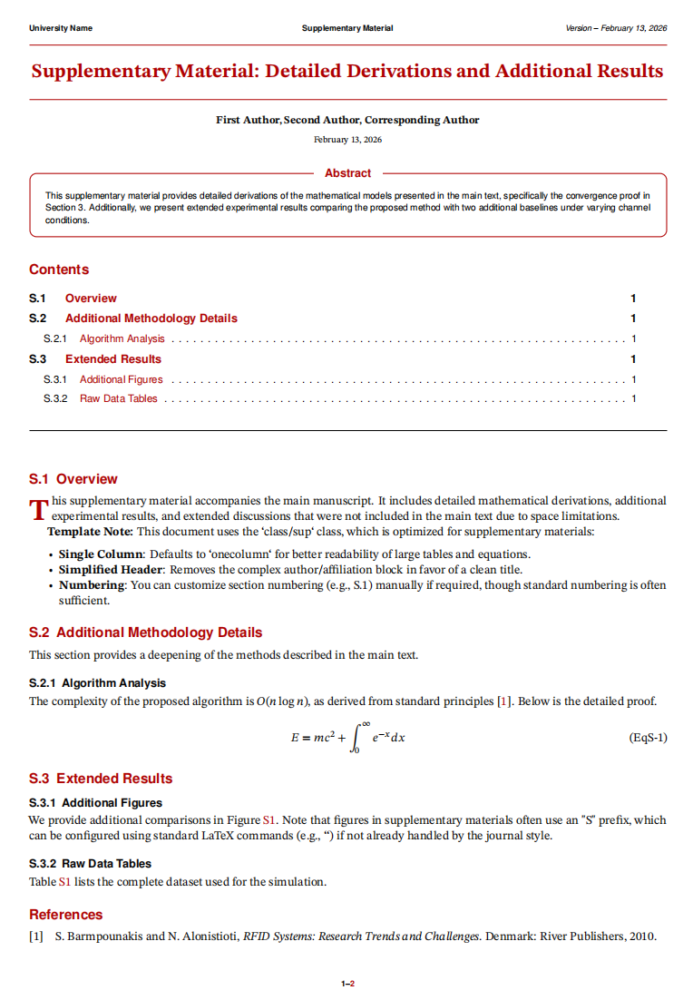
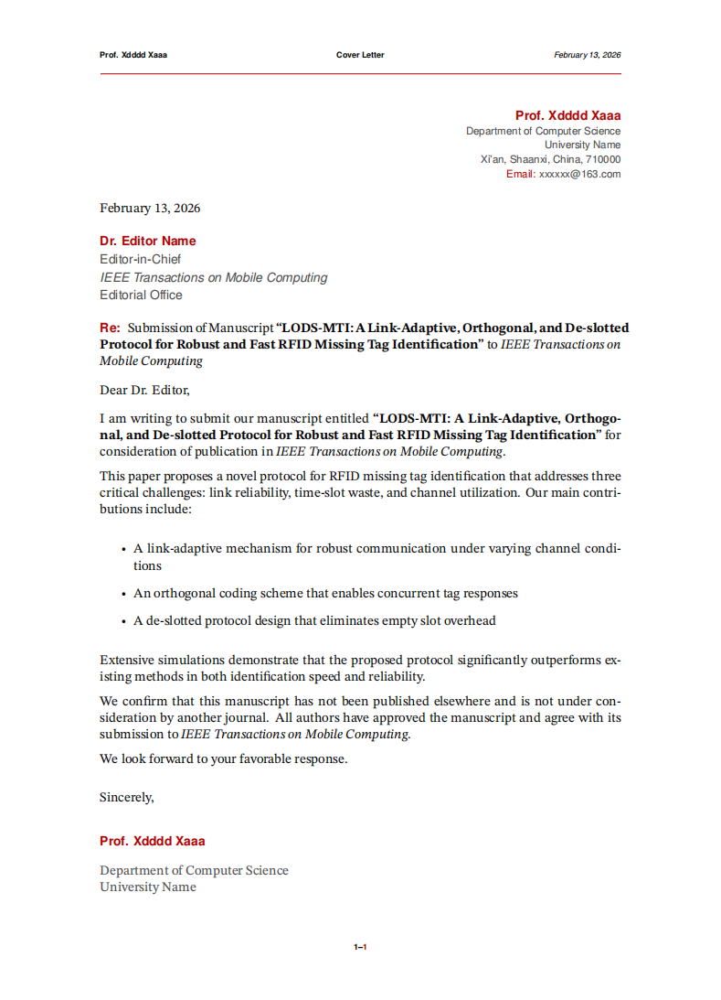
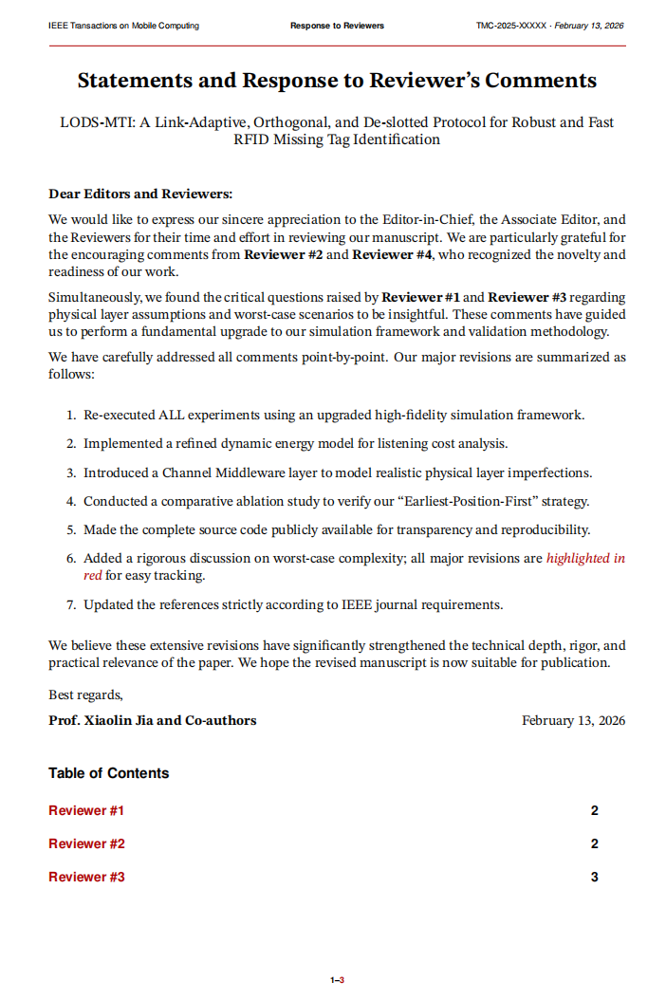
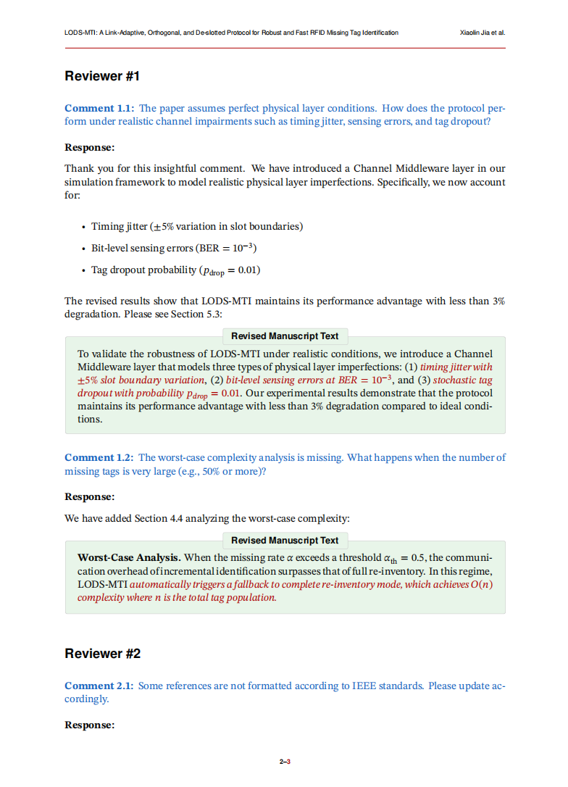

# 学术 LaTeX 模板套件 | Academic LaTeX Template Suite

[中文](#中文说明) | [English](#english)

---

<a name="中文说明"></a>

## 中文说明

### 概述

这是一套面向论文投稿流程的学术 LaTeX 模板套件，覆盖最常见的 **四种文档类型**：

| 模板 | 文件 | 文档类 | 用途 |
|------|------|--------|------|
| **正文** | `Main.tex` | `class/main.cls` | 双栏学术论文 |
| **补充材料** | `Supplementary.tex` | `class/sup.cls` | 单栏补充材料 |
| **投稿信** | `Cover_Letter.tex` | `class/cover_letter.cls` | 投稿附信 |
| **审稿回复** | `Response.tex` | `class/response.cls` | 逐条回复审稿意见 |

### 效果预览

#### 正文 (`Main.tex`)


#### 补充材料 (`Supplementary.tex`)


#### 投稿信 (`Cover_Letter.tex`)


#### 审稿回复 (`Response.tex`)



---

### 文件结构

```
Latex-Template/
├── Main.tex                  # 正文（编辑入口）
├── Supplementary.tex         # 补充材料
├── Cover_Letter.tex          # 投稿信
├── Response.tex              # 审稿回复
├── ref.bib                   # 参考文献数据库
├── abstract_graph.pdf        # 图形化摘要示例
├── figure/                   # 图片目录
├── class/                    # 文档类文件（请勿修改）
│   ├── main.cls              # 正文文档类
│   ├── sup.cls               # 补充材料文档类
│   ├── cover_letter.cls      # 投稿信文档类
│   ├── response.cls          # 审稿回复文档类
│   ├── academicbase.sty      # 正文/补充材料共享基础层
│   ├── academicenvs.sty      # 共享主题与环境
│   ├── academiclang.sty      # 多语言文本
│   └── academicletterbase.sty # Cover/Response 共享基础层
└── README.md
```

### 快速开始

#### 1. 编译方法

所有模板建议使用 **XeLaTeX** 编译。含参考文献的文档（`Main`、`Supplementary`）：

```bash
xelatex Main
biber Main          # 注意：是 biber，不是 bibtex
xelatex Main
xelatex Main
```

投稿信和审稿回复（通常无参考文献）：

```bash
xelatex Cover_Letter          # 编译一次即可
xelatex Response              # 编译两次（生成目录）
```

#### 2. 主题色

所有模板统一支持三种主题色，通过 `\academictheme{颜色}` 切换：

| 颜色 | 命令 | 色值 |
|------|------|------|
| 学术红（默认） | `\academictheme{red}` | `#B00000` |
| 优雅紫 | `\academictheme{purple}` | `#6A1B9A` |
| 经典蓝 | `\academictheme{blue}` | `#1565C0` |

#### 3. VS Code 配置

在 `.tex` 文件顶部添加：

```latex
%!TEX program = xelatex
%!BIB program = biber
```

或在 `settings.json` 中配置编译配方（见下方英文部分 JSON 示例）。

---

### 使用建议

1. **先选入口文件**：正文用 `Main.tex`，补充材料用 `Supplementary.tex`，投稿信用 `Cover_Letter.tex`，回复信用 `Response.tex`。  
2. **优先改元数据块**：标题、作者、单位、通讯作者、期刊名、稿件号等信息都集中在导言区顶部。  
3. **保留类文件不动**：日常写作只编辑入口 `.tex` 文件；只有需要修改全局版式时才进入 `class/`。  
4. **按需开启功能**：如摘要、图文摘要、跨文档引用、回复状态标签等。  

---

### 各模板使用说明

#### 正文 (`Main.tex`)

用于主论文正文，默认双栏，适合投稿稿件、预印本和技术报告。

```latex
\documentclass[10pt,a4paper,twoside]{class/main}
\academictheme{red}

\title{论文标题}
\author[1]{作者一}
\affil[1]{单位}
\corres{通讯作者}
\email{email@example.com}
\leadauthor{作者一 et al.}           % 页眉显示
\institution{单位名称}               % 页脚显示

\setabstractenabled{true}           % 开启摘要
\setbool{corres-info}{true}         % 开启通讯信息

\begin{abstract}
    摘要内容。
\end{abstract}
\keywords{关键词1, 关键词2}
```

建议把正文内容按期刊结构替换为：`Introduction`、`Related Work`、`Method`、`Experiments`、`Conclusion`。

---

#### 补充材料 (`Supplementary.tex`)

用于补充推导、额外实验、附录图表和复现实验细节，默认单栏。

```latex
\documentclass[10pt,a4paper,onecolumn]{class/sup}
\title{Supplementary Material: ...}
\author{作者列表}
\setupxr{Main}                      % 交叉引用正文（需先编译 Main.tex）
```

如果不需要交叉引用正文，可删除 `\setupxr{Main}`。

---

#### 投稿信 (`Cover_Letter.tex`)

用于投稿附信。设置论文标题和期刊名后，主题行会自动生成。

```latex
\documentclass{class/cover_letter}

\papertitle{论文标题}                % 定义一次，全局复用
\journalname{期刊名称}

\sendername{Prof. 张三}
\senderaffiliation{计算机系 \\ 某某大学}
\senderemail{zhangsan@example.com}

\recipientname{Dr. Editor}
\recipienttitle{Editor-in-Chief}
\opening{Dear Dr. Editor,}
\closing{Sincerely,}
```

正文中用 `\thepapertitle` 和 `\thejournalname` 引用论文标题和期刊名。

---

#### 审稿回复 (`Response.tex`)

**最核心的三个环境：**

```latex
\reviewer                           % 创建 "Reviewer #1" 分区

\begin{reviewercomment}             % 审稿意见（蓝色文字）
    审稿人的问题...
\end{reviewercomment}

\begin{authorresponse}              % 作者回复（黑色，支持多段+列表）
    我们的回复...

    \begin{revisedtext}             % 正文修改段落（绿色背景框）
        修改后的正文，其中 \added{新增内容用红色斜体标记}。
    \end{revisedtext}
\end{authorresponse}
```

**修改标记命令：**

| 命令 | 效果 | 场景 |
|------|------|------|
| `\added{文字}` | 红色斜体 | 文本/公式中标记新增内容 |
| `\deleted{文字}` | 红色删除线 | 标记删除内容 |
| `\highlight{文字}` | 黄色背景 | 通用高亮 |

**完整流程：**

1. 设置论文信息 → `\makeresponsetitle`
2. 写致编辑总结信
3. `\makeresponsetoc` 生成目录
4. 用 `\reviewer` 分区，逐条回复
5. 编译 **两次**（第一次生成目录数据）

---

### 常见问题

1. **参考文献显示 `[?]`** → 使用 `biber` 而非 `bibtex`，参见编译配置。
2. **摘要报错** → `\begin{abstract}...\end{abstract}` 必须在 `\begin{document}` **之前**。
3. **审稿回复目录为空** → 编译 **两次**。
4. **投稿信 Subject 为空** → 检查是否定义了 `\papertitle` 和 `\journalname`。

---

---

<a name="english"></a>

## English Guide

### Overview

A practical LaTeX template suite for academic submission workflows, covering **four** common document types:

| Template | File | Class | Purpose |
|----------|------|-------|---------|
| **Main Paper** | `Main.tex` | `class/main.cls` | Two-column academic paper |
| **Supplementary** | `Supplementary.tex` | `class/sup.cls` | Single-column supplementary material |
| **Cover Letter** | `Cover_Letter.tex` | `class/cover_letter.cls` | Submission cover letter |
| **Response to Reviewers** | `Response.tex` | `class/response.cls` | Point-by-point reviewer response |

### File Structure

```
Latex-Template/
├── Main.tex                  # Main paper (entry point)
├── Supplementary.tex         # Supplementary material
├── Cover_Letter.tex          # Cover letter
├── Response.tex              # Response to reviewers
├── ref.bib                   # Bibliography database
├── abstract_graph.pdf        # Graphical abstract example
├── figure/                   # Figures directory
├── class/                    # Class files (do NOT modify)
│   ├── main.cls              # Main paper class
│   ├── sup.cls               # Supplementary class
│   ├── cover_letter.cls      # Cover letter class
│   ├── response.cls          # Response class
│   ├── academicbase.sty      # Shared base for main/supplementary
│   ├── academicenvs.sty      # Shared theme and environments
│   ├── academiclang.sty      # Language helpers
│   └── academicletterbase.sty # Shared base for cover/response
└── README.md
```

### Quick Start

#### 1. Compilation

All templates are designed for **XeLaTeX**. For documents with bibliography (`Main`, `Supplementary`):

```bash
xelatex Main
biber Main
xelatex Main
xelatex Main
```

For Cover Letter and Response (usually without bibliography):

```bash
xelatex Cover_Letter
xelatex Response        # Run twice for TOC
```

#### 2. Theme Colors

All templates support three built-in theme colors via `\academictheme{color}`:

| Color | Command | Hex |
|-------|---------|-----|
| Red (default) | `\academictheme{red}` | `#B00000` |
| Purple | `\academictheme{purple}` | `#6A1B9A` |
| Blue | `\academictheme{blue}` | `#1565C0` |

#### 3. VS Code Configuration (LaTeX Workshop)

Add these **magic comments** at the top of your `.tex` file:

```latex
%!TEX program = xelatex
%!BIB program = biber
```

Or configure `settings.json`:

```json
"latex-workshop.latex.recipes": [
    {
        "name": "XeLaTeX -> Biber -> XeLaTeX x2",
        "tools": ["xelatex", "biber", "xelatex", "xelatex"]
    }
],
"latex-workshop.latex.tools": [
    {
        "name": "xelatex",
        "command": "xelatex",
        "args": ["-synctex=1", "-interaction=nonstopmode", "-file-line-error", "%DOC%"]
    },
    {
        "name": "biber",
        "command": "biber",
        "args": ["%DOCFILE%"]
    }
]
```

---

### Recommended Workflow

1. **Choose the right entry file**: `Main.tex`, `Supplementary.tex`, `Cover_Letter.tex`, or `Response.tex`.  
2. **Edit metadata first**: title, authors, affiliations, journal name, manuscript ID, and correspondence information.  
3. **Leave class files unchanged** unless you are intentionally adjusting the global style.  
4. **Enable only the features you need**, such as abstract boxes, graphical abstracts, cross-document references, or response status labels.  

---

### Template Details

#### Main Paper (`Main.tex`)

Use this file for the main manuscript. It is two-column by default.

```latex
\documentclass[10pt,a4paper,twoside]{class/main}
\academictheme{red}

\title{Your Paper Title}
\author[1]{Author One}
\affil[1]{University A}
\corres{Corresponding Author}
\email{email@example.com}
\leadauthor{Author One et al.}
\institution{University Name}

\setabstractenabled{true}
\setbool{corres-info}{true}

\begin{abstract}
    Your abstract here.
\end{abstract}
\keywords{keyword1, keyword2}
```

**Features:** Abstract, graphical abstract (`\graphicalabstract`), running headers, BibLaTeX references, ORCID links, correspondence info.

---

#### Supplementary Material (`Supplementary.tex`)

```latex
\documentclass[10pt,a4paper,onecolumn]{class/sup}
\title{Supplementary Material: ...}
\author{Author list}
\setupxr{Main}               % Cross-reference Main.tex
```

**Features:** Table of contents, cross-document references, and version info in the footer.

---

#### Cover Letter (`Cover_Letter.tex`)

```latex
\documentclass{class/cover_letter}
\papertitle{Your Paper Title}
\journalname{Target Journal}
\sendername{Prof. Your Name}
\recipientname{Dr. Editor Name}
\opening{Dear Dr. Editor,}
\closing{Sincerely,}
```

Use `\thepapertitle` and `\thejournalname` in the letter body to reference the manuscript and journal names.

---

#### Response to Reviewers (`Response.tex`)

**Core environments:**

| Environment | Purpose | Visual style |
|-------------|---------|-------------|
| `\reviewer` | Section divider per reviewer | Black bold heading |
| `reviewercomment` | Reviewer's original comment | Blue text |
| `authorresponse` | Author's reply | Black text |
| `revisedtext` | Quoted revised manuscript text | Green background box |

**Markup commands:**

| Command | Effect |
|---------|--------|
| `\added{text}` | Red italic (text) / Red (math) |
| `\deleted{text}` | Red strikethrough |
| `\highlight{text}` | Yellow background |

---

### FAQ

1. **References show `[?]`** → Use `biber` (not `bibtex`).
2. **Abstract error** → `\begin{abstract}` must be **before** `\begin{document}`.
3. **Response TOC missing** → Compile **twice**.
4. **Cover Letter subject blank** → Define `\papertitle` and `\journalname`.

---

### License

This template is provided as-is for academic use. Feel free to modify for your own projects.
